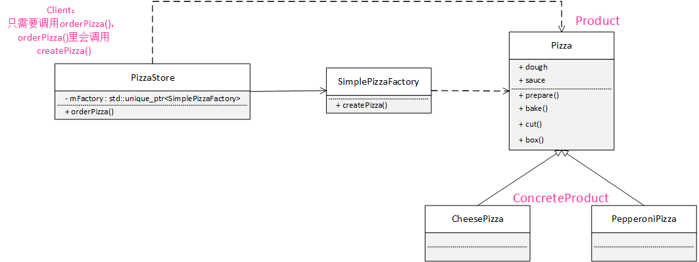
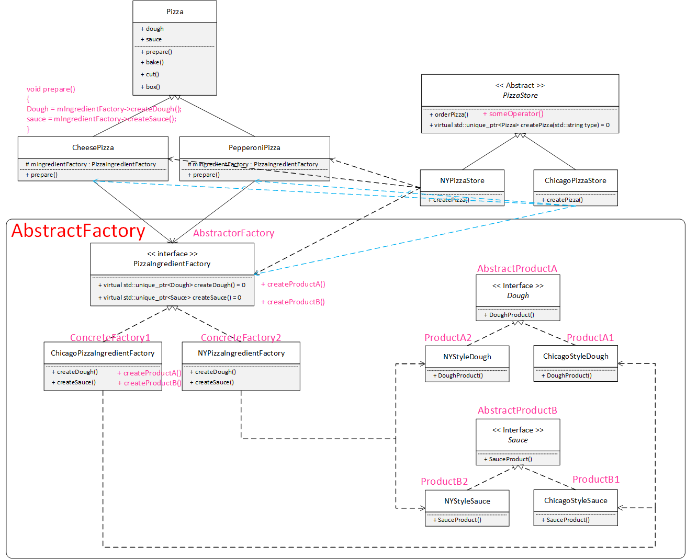
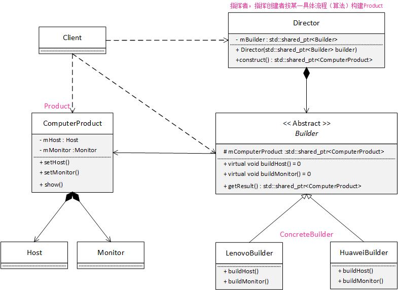
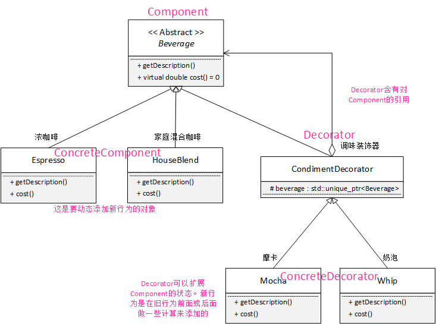
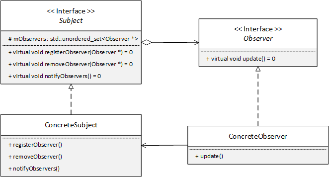

# 设计模式

23种经典设计模式共分为3种类型，分别是创建型、结构型和行为型。


创建型设计模式包括：单例模式、工厂模式、建造者模式、原型模式。它主要解决对象的创建问题，封装复杂的创建过程，解耦对象的创建代码和使用代码。

结构型模式主要总结了一些类或对象组合在一起的经典结构，这些经典的结构可以解决特定应用场景的问题。结构型模式包括：代理模式、桥接模式、装饰器模式、适配器模式、门面模式、组合模式、享元模式。

我们知道，创建型设计模式主要解决“对象的创建”问题，结构型设计模式主要解决“类或对象的组合”问题，那行为型设计模式主要解决的就是“类或对象之间的交互”问题。行为型模式比较多，有11种，它们分别是：观察者模式、模板模式、策略模式、职责链模式、迭代器模式、状态模式、访问者模式、备忘录模式、命令模式、解释器模式、中介模式。

## 创建型

### 单例模式

确保一个类仅存在一个实例（如任务管理器，内存池等），并提供了对此唯一实例的全局访问点。可以认为单例是一种更加优雅的全局变量。相对于全局变量，它还有其他优点：

- 确保一个类只创建一个实例
- 为对象分配和销毁提供控制
- 支持线程安全地访问对象的全局状态
- 避免污染全局名字空间

缺点：

- 单例模式一般没有接口，扩展困难。如果要扩展，则除了修改原来的代码，没有第二种途径，违背开闭原则。
- 在并发测试中，单例模式不利于代码调试。在调试过程中，如果单例中的代码没有执行完，也不能模拟生成一个新的对象。
- 单例模式的功能代码通常写在一个类中，如果功能设计不合理，则很容易违背单一职责原则。

为了阻止客户自行分配、销毁、复制该类对象，将默认构造、析构、复制构造和赋值操作符都声明为私有（或者protected，为了方便子类继承，没什么好处）并且不实现（= delete）。

#### 饿汉模式

单例实例在类装载时就构建，急切初始化。[源码](.//eager_singleton/Singleton.hpp)

程序输出如下所示，可以看到Singleton的构造在main()函数之前，这样就保证了线程安全。

```
Singleton:15
start main()
getInstance:27
end main()
~Garbo:38
~Singleton:20
```

线程安全性： 实例在类加载的时候即被实例化，因此线程安全。

是否懒加载： 没有延迟加载，如果长时间没用到这个实例，则会造成内存的浪费。

性能： 性能比较好

#### 懒汉模式-同步锁

```
start main()
getInstance:32
Singleton:19
end main()
~Garbo:48
~Singleton:25
```

线程安全性： 线程安全

是否懒加载： 懒加载

性能： 每次调用`getinstance()`都需要加锁和释放，使得多线程执行退化为串行执行，性能差，不推荐使用。

【注意】

C++中`volatile`等于插入编译器级别屏障，因此并不能阻止CPU硬件级别导致的重排。Java里加`volatile`就可以。

#### 懒汉模式-双检锁（DCLP）

双重检查锁模式是一种非常好的单例实现模式，解决了单例、性能、线程安全问题，双重检测锁模式看上去完美无缺，如果不加内存屏障也会出现问题。

```C++
sInstance = new Singleton();
```

可以被拆分为：

1. 用operator new在堆上非配一块内存
2. 用placement new在刚刚分配的内存上调用构造函数以构造对象
3. 将已分配内存的指针赋予instance

在此3步中，2和3和可以调换的。这取决于编译器的实现或者CPU动态调度换序（尤其在多处理器环境下）。一旦一个A线程先执行3后执行2，另一个线程B在A之行为3后（还未执行2进行构造）发现instance已经非空，便不加锁直接访问，势必造成问题。

对于编译器而言，为了提高速度可能将一个变量缓存到寄存器而不写回，也可能为了效率交换2条不相干的相邻指令。那么使用volatile看似可以完美解决问题，volatile作用如下：

1. 阻止编译器对volatile变量进行优化，每次读写必须从内存里获取。
2. 阻止编译器调整volatile变量的指令顺序。

看似万无一失其实不然。volatile只能阻止编译器调整顺序，却无法阻止CPU动态调度换序。

在某些编译器中使用volatile可以达到内存同步的效果。但必须记住，这不是volatitle的设计意图，也不能通用地达到内存同步的效果。volatitle的语义只是防止编译器“优化”掉对内存的读写而已。它的合适用法，目前主要是用来读写映射到内存地址上的IO操作。由于volatile 不能在多处理器的环境下确保多个线程看到同样顺序的数据变化，在今天的通用程序中，不应该再看到volatitle的出现。

多处理器环境下，每个处理器都有各自的高速缓存，但所有处理器共享内存空间。这种架构需要设计者精确定义一个处理器该如何向共享内存执行写操作，又何时执行读操作，并使这个过程对其他处理器可见。我们很容易想象这样的场景：当某一个处理器在自己的高速缓存中更新的某个共享变量的值，但它并没有将该值更新至共享主存中，更不用说将该值更新到其他处理器的缓存中了。这种缓存间共享变量值不一致的情况被称为缓存一致性问题(cache coherency problem)。

[单例线程安全实现、DCLP及其注意事项、饿汉懒汉实现方式](https://blog.csdn.net/brahmsjiang/article/details/111186828?spm=1001.2101.3001.6661.1&utm_medium=distribute.pc_relevant_t0.none-task-blog-2%7Edefault%7EOPENSEARCH%7EHighlightScore-1.queryctrv2&depth_1-utm_source=distribute.pc_relevant_t0.none-task-blog-2%7Edefault%7EOPENSEARCH%7EHighlightScore-1.queryctrv2&utm_relevant_index=1)

[volatile与内存屏障总结](https://zhuanlan.zhihu.com/p/43526907)

**Q：单例模式是否可以继承**

A：不推荐继承。

一、单例模式的构造函数是private的，不能用私有构造函数来扩展类，所以必须把构造函数改成public或者protected。但这样就不算是真正的“单件”了，因为别的类也可以实例化它。

二、如果更改了构造函数的访问权限，还有另一个问题。单例的实现是依赖静态变量，如果继承，会导致所有的子类共享同一个静态的实例变量，该如何区分子类呢？（《Head First 设计模式》中，提出，如果想让子类顺利工作，基类必须实现注册表功能。P185）。

通常继承单例不会有什么好处。

### 工厂模式

#### 简单工厂



严格的说简单工厂不是一个设计模式（不在23种设计模式之列），反而更像是一种编程习惯。

**Q：为什么要单独创建一个类SimplePizzaFactory，把改变的部分createPizza放到该类里？**

A：不适用简单工厂模式，createPizza()是放在PizzaStore里，也只有pizzaStore可以使用createPizza。如果调用createPizza的客户不止有PizzaStore，还有其它的，类如披萨店菜单，宅急送之类的，它们也需要调用createPizza()。总而言之，SimplePizzaFactory可以有很多不同的客户。

把创建披萨的代码封装进一个类`SimplePizzaFactory`，当以后实现改变时，只需要修改这个类即可。同时，还将具体实例化的过程，从客户代码中删除。

**Q：  createPizza可以为一个静态方法，参考code，`static std::unique_ptr<Pizza> createPizza(std::string type)`**，这与非静态方法有什么区别？

A：在简单工厂模式中创建实例的方法通常为静态（static）方法，因此简单工厂模式（Simple Factory Pattern）又叫作静态工厂方法模式（Static Factory Method Pattern）。它的优点是不需要创建简单工厂对象就可以创建产品。在 《head first 设计模式》，认为静态工厂方法有缺点，静态方法不能重写，不能通过继承来改变创建方法的行为【P115】。

#### 工厂方法


**定义：工厂方法模式定义了一个创建对象的接口，但由子类决定要实例化的类是哪一个。工厂方法让类把实例化推迟到子类。**

工厂方法让创建的过程延迟到子类，让子类决定创建何种对象。

优点：

- 用户只需要知道具体工厂的名称就可得到所要的产品，无须知道产品的具体创建过程。
- 灵活性增强，对于新产品的创建，只需多写一个相应的工厂类。
- 典型的解耦框架。高层模块只需要知道产品的抽象类，无须关心其他实现类，满足迪米特法则、依赖倒置原则和里氏替换原则。

缺点：

- 类的个数容易过多，增加复杂度
- 增加了系统的抽象性和理解难度
- 只能生产一种产品，此弊端可使用抽象工厂模式解决。

**Q：当只有一个ConcreteCreator的时候，工厂方法模式有什么优点？**

A：尽管只有一个具体创建者，工厂方法模式依然有用。**因为它将产品的“实现”从“使用”中解耦**。如果增加产品或者改变产品的实现，Creator不会受到影响。

**Q：工厂方法的创建者Creator是否总是抽象的？**

A：不，可以定义一个默认的工厂方法来创建具体产品。这样，即使Creator没有任何子类，也可以创建产品。

**Q：简单工厂和工厂方法的差异？**

A：简单工厂把全部的事情，在一个地方`SimplePizzaFactory`处理完了，然而工厂方法却只是搭建一个框架，让子类决定要如何实现。简单工厂的做法只是将对象的创建封装起来，并不具备工厂方法的弹性，因为简单工厂不能变更正在创建的产品，而工厂方法的产品的创建取决于继承Creator的具体类。

#### 抽象工厂



对于上图主要参考黑框中的部分，那是抽象工厂的类图，黑框外的部分基本属于Client。《Head First 设计模式》中，举例的披萨店原料厂的场景有些复杂，Client端的code有些干扰理解。一个比较好的场景可以参考[廖雪峰里的一个例子](https://www.liaoxuefeng.com/wiki/1252599548343744/1281319134822433)，非常的清晰易懂。

**定义：抽象工厂模式提供一个创建一系列相关或相互依赖对象的接口，而无需指定它们具体的类。**

抽象工厂模式允许客户使用抽象的接口来创建一组相关的产品，而不需要知道（或关心）实际产出的具体产品是什么。这样一来，客户就从具体的产品中被解耦。

使用抽象工厂模式一般要满足以下条件。

- 系统中有多个产品族，每个具体工厂创建同一族但属于不同等级结构的产品。
- 系统一次只可能消费其中某一族产品，即同族的产品一起使用。

（举例：产品族指的是同一个产品家族，如例子中的纽约原料工厂和芝加哥原料工厂就是两个不同的产品族，它们都可以生产Dough和Sauce。等级，它指的是不同产品族的同类产品，如纽约风格的Dough和芝加哥风格的Dough）


抽象工厂模式除了具有工厂方法模式的优点外，其他主要优点如下。

- 可以在类的内部对产品族中相关联的多等级产品共同管理，而不必专门引入多个新的类来进行管理。
- 当需要产品族时，抽象工厂可以保证客户端始终只使用同一个产品的产品组。
- 抽象工厂增强了程序的可扩展性，当增加一个新的产品族时，不需要修改原代码，满足开闭原则。

缺点：

- 当产品族中需要增加一个新的产品时，所有的工厂类都需要进行修改。增加了系统的抽象性和理解难度。

**Q：工厂方法是否潜伏在抽象工厂里面？**

A：抽象工厂里的每一个创建方法（createDough，createSauce）经常以工厂方法的方式实现（每个方法被声明为抽象，而子类覆盖这些方法来创建具体的产品）。抽象工厂的任务是定义一个负责创建一组产品的接口。这个接口里的每个方法都负责创建一个具体的产品，同时，利用实现（继承）抽象工厂的子类来提供这些具体的创建做方法。所以，在抽象工厂中利用工厂方法实现创建是相当自然的做法。

**Q：何时使用工厂方法，何时使用抽象工厂？**

- 当需要把客户代码从需要实例化的具体类中解耦，或者目前不知道将来要实例化哪些具体类时，使用工厂方法。（继承Creator，并实现factoryMethod()）

- 当需要创建产品家族和想让制造的相关产品集合起来时，用抽象工厂。

【P159】

### 建造者模式



**定义：它是将一个复杂的对象分解为多个简单的对象，使用多个简单的对象一步一步构建成一个复杂的对象。**

**主要解决：**在软件系统中，有时候面临着"一个复杂对象"的创建工作，其通常由各个部分的子对象用一定的算法构成。由于需求的变化，这个复杂对象的各个部分经常面临着剧烈的变化，但是将它们组合在一起的算法却相对稳定。例如demo中要组装一台电脑ComputerProduct，需要主机Host和显示器Monitor。组装ComputerProduct的算法是固定的，先buildHost()再buildMonitor()，但每家组装厂的零件却不一样，即各个部分经常面临着剧烈的变化。如Lenovo组装厂使用Lenovo品牌的Host和Monitor，Huawei组装厂使用Huawei品牌的Host和Monitor。所以对每个具体的组装厂，它们会用同样的建造流程建造不同的ComputerProduct。

该模式的主要优点如下：

- 封装性好，构建和表示分离。

- 扩展性好，各个具体的建造者相互独立，有利于系统的解耦。

- 客户端不必知道产品内部组成的细节，建造者可以对创建过程逐步细化，而不对其它模块产生任何影响，便于控制细节。


其缺点如下：

- 产品的组成部分必须相同，这限制了其使用范围。
- 如果产品的内部变化复杂，如果产品内部发生变化，则建造者也要同步修改，后期维护成本较大。

建造者（Builder）模式和工厂模式的关注点不同：建造者模式注重零部件的组装过程，而工厂方法模式更注重零部件的创建过程，但两者可以结合使用。如果创建简单对象，通常都是使用工厂模式进行创建，而如果创建复杂对象，就可以考虑使用建造者模式。

**Q：建造者模式和工厂模式的区别？**

A：如下

- 建造者模式更加注重方法的调用顺序，工厂模式注重创建对象。
- 创建对象的力度不同，建造者模式创建复杂的对象，由各种复杂的部件组成，工厂模式创建出来的对象都一样
- 关注重点不一样，工厂模式只需要把对象创建出来就可以了，而建造者模式不仅要创建出对象，还要知道对象由哪些部件组成。
- 建造者模式根据建造过程中的顺序不一样，最终对象部件组成也不一样。

## 结构型

### 代理模式

### 桥接模式

**定义：将抽象与实现分离，使它们可以独立变化。它是用组合关系代替继承关系来实现，从而降低了抽象和实现这两个可变维度的耦合度。**

**场景：**某些类具有两个或者多个维度的变化，如demo所示。购买一款包，按类型分，它可以是挎包，也可以是钱包；按颜色分，它可以是红色，也可以是黄色。如果用继承的话，挎包和钱包继承包，红色挎包和黄色挎包继承挎包，红色钱包和黄色钱包继承钱包。如果再多一个维度，按皮质分，有牛皮和鳄鱼皮，那么让牛皮红色挎包和鳄鱼皮红色挎包继承红色挎包？每加一个维度，使用继承，子类就要翻一倍，因此需要改变。

抽象与实现分离指的是抽象，---***这里参照大话设计模式***，明天整理

[秒懂设计模式之桥接模式（Bridge Pattern）](https://zhuanlan.zhihu.com/p/58903776)

### 装饰器模式



**定义：在不改变现有对象结构的情况下，动态地给一个对象添加一些额外的职责。若要扩展功能，装饰者提供了比继承更有弹性的替代方案。**

装饰器模式的主要优点有：

- 装饰器是继承的有力补充，比继承灵活，在不改变原有对象的情况下，动态的给一个对象扩展功能，即插即用
- 通过使用不用装饰类及这些装饰类的排列组合，可以实现不同效果
- 装饰器模式完全遵守开闭原则

其主要缺点是：

- 装饰器模式会增加许多子类，过度使用会增加程序得复杂性。

### 适配器模式

**定义：将一个接口转换成客户希望的另一个接口，使接口不兼容的那些类可以一起工作。**

主要优点如下：

- 客户端通过适配器可以透明地调用目标接口。
- 复用了现存的类，程序员不需要修改原有代码而重用现有的适配者类。
- 将目标类和适配者类解耦，解决了目标类和适配者类接口不一致的问题。
- 在很多业务场景中符合开闭原则。


缺点：

- 适配器编写过程需要结合业务场景全面考虑，可能会增加系统的复杂性。
- 增加代码阅读难度，降低代码可读性，过多使用适配器会使系统代码变得凌乱。

适配器模式既可以作为类结构型模式，也可以作为对象结构型模式。

根据适配器类与适配者类的关系不同，适配器模式可分为对象适配器和类适配器两种，在对象适配器模式中，适配器（Adapter）与适配者（Adaptee）之间是关联关系（Adapter中有对Adaptee的引用）；在类适配器模式中，适配器与适配者之间是继承（或实现）关系。在实际开发中，对象适配器的使用频率更高。

适配器的实现就是把客户类的请求转化为对适配者的相应接口的调用。也就是说：当客户类调用适配器的方法时，在适配器类的内部将调用适配者类的方法，而这个过程对客户类是不可见的，客户类并不直接访问适配者类。因此，适配器让那些由于接口不兼容而不能交互的类可以一起工作。

对照code分析：

可以将适配器（objectAdapter，classAdapter）理解为一个包装者，它通过调用老接口（Adaptee）实现新接口(Target)里的方法，而客户端只需要调用Target实例里的方法（多态）就可以了。

两种类型适配器的Adaptee和Target是完全一样的。

#### 类适配器


类适配器ClassAdapter继承Adaptee实现接口Target里的方法

#### 对象适配器


对象适配器ObjectAdapter含有适配者Adaptee的引用，通过Adaptee访问旧接口的方法。ObjectAdapter与Adaptee是组合关系。

### 外观模式（门面模式）

### 组合模式

把下面的链接整理一下就差不多了

[组合模式的安全模式与透明模式](https://blog.csdn.net/moakun/article/details/79945534)

## 行为型

### 观察者模式



上图是方便理解的版本，功能较少。

下图是git仓库中demo的类图，较为复杂，且做了一些改变。


**定义： 定义对象间的一种一对多的依赖关系，当一个对象的状态发生改变时，所有依赖于它的对象都会收到通知并自动更新。**

主要解决：**一个对象状态改变给其他对象通知的问题，而且要考虑到易用和低耦合，保证高度的协作**。

何时使用：一个对象（目标对象）的状态发生改变，所有的依赖对象（观察者对象）都将得到通知，进行广播通知。

如何解决：使用面向对象技术，可以将这种依赖关系弱化。

关键代码：在抽象类里有一个 unordered_set 存放观察者。

优点： 

1. 降低了目标与观察者之间的耦合关系（观察者和被观察者是抽象耦合的，可以交互，但不清楚彼此的细节），符合依赖倒置原则。
2. 建立一套触发机制。

缺点： 

1. 如果一个被观察者对象有很多的直接和间接的观察者的话，将所有的观察者都通知到会花费很多时间。 
2. 如果在观察者和观察目标之间有循环依赖的话，观察目标会触发它们之间进行循环调用，可能导致系统崩溃。 
3. 观察者模式没有相应的机制让观察者知道所观察的目标对象是怎么发生变化的，而仅仅只是知道观察目标发生了变化。

Subject和Observer的生命周期不同，应是聚合关系而非组合关系。

**Q：为什么Observer要保存对Subject的引用？**

A：在未来想要取消注册的时候，Observer有对Subject的引用，会方便取消注册。或者直接对外开放`removeSubject`的接口。

**Q：Subject采取推或拉的方式的优劣是什么？**

A：采用拉的方式，Observer可能需要多次get数据才能收集全数据，并且Observer不知道数据何时更新。而采用推，Observer会在一次通知中得到所有数据。但有时Observer可能只需要一点点数据，而更新后Subject会强迫Observer收到一堆数据，这时用拉的方式会更好一些，并且也方便Subject未来扩展，毕竟新增加一个数据，Subject只需要对外开放一个getter接口就行了。推拉这两种方式都有优劣。

我个人建议用推，然后在update里加一个if判断一个枚举类型，是该Observer关注的类型notify，update才会真正执行，否则直接return。

### 模板模式

### 策略模式


**定义：策略模式定义了算法族，分别封装起来，让它们之间可以相互替换。使算法的变化独立于使用算法的客户。**

策略模式的主要优点如下：

- 多重条件语句不易维护，而使用策略模式可以避免使用多重条件语句，如 if...else 语句、switch...case 语句。
- 策略模式提供了一系列的可供重用的算法族，恰当使用继承可以把算法族的公共代码转移到父类里面，从而避免重复的代码。
- 策略模式可以提供相同行为的不同实现，客户可以根据不同时间或空间要求选择不同的。
- **策略模式提供了对开闭原则的完美支持，可以在不修改原代码的情况下，灵活增加新算法。**
- 策略模式把算法的使用放到抽象类中（客户端），而算法的实现移到具体策略类中，实现了二者的分离。

其主要缺点如下：

- 客户端必须理解所有策略算法的区别，以便适时选择恰当的算法类。
- 策略模式造成很多的策略类，增加维护难度。

### 责任链模式

### 状态模式

### 备忘录模式

### 命令模式

### 中介模式

要注意与观察者模式的区别。

https://blog.csdn.net/yin18827152962/article/details/82669068

## 设计模式的几个原则

| 设计原则     | 一句话归纳                                                   | 目的                                       |
| ------------ | ------------------------------------------------------------ | ------------------------------------------ |
| 单一职责原则 | 一个类只干一件事，实现类要单一                               | 便于理解，提高代码的可读性                 |
| 依赖倒置原则 | 高层不应该依赖低层，要面向接口编程                           | 更利于代码结构的升级扩展                   |
| 开闭原则     | 对扩展开放，对修改关闭                                       | 降低维护带来的新风险                       |
| 迪米特法则   | 不该知道的不要知道，一个类应该保持对其它对象最少的了解，降低耦合度 | 只和朋友交流，不和陌生人说话，减少代码臃肿 |
| 接口隔离原则 | 一个接口只干一件事，接口要精简单一                           | 功能解耦，高聚合、低耦合                   |
| 里氏替换原则 | 不要破坏继承体系，子类重写方法功能发生改变，不应该影响父类方法的含义 | 防止继承泛滥                               |
| 合成复用原则 | 尽量使用组合或者聚合关系实现代码复用，少使用继承             | 降低代码耦合                               |

### 单一职责原则 SRP

Single Responsibility Principle， SRP

**一个类或者一个接口只负责唯一项职责，尽量设计出功能单一的接口。**

当我们在做编程的时候，很自然的回个一个类加上各种各样的功能。这样意味着，无论任何需求要来，你都需要更改这个类，这样其实是很糟糕的，维护麻烦，复用不可能，也缺乏灵活性。如果一个类承担的职责过多，就等于把这些职责耦合起来，一个职责变化可能会削弱或者抑制这个类完成其他职责的能力。这种耦合会导致脆弱的设计，当变化发生时，设计会遭到很多意想不到的破坏。

+ 一个类应该仅仅有一个引起它变化的原因
+ 变化的方向隐含着类的责任

### 依赖倒置原则 DIP

Dependence Inversion Principle，DIP

**高层模块不应该依赖低层模块具体实现，解耦高层与低层。既面向接口编程，当实现发生变化时，只需提供新的实现类，不需要修改高层模块代码。**

有时候为了代码复用，一般会把常用的代码写成函数或类库。这样开发新项目的时候直接用就行了。比如做项目的时候大多要访问数据库，所以我们把访问数据库的代码写成了函数。每次做项目去调用这些函数。那么问题来了，我们要做新项目的时候，发现业务逻辑高层模块都是一样的，但客户却希望使用不同的数据库或存储方式，这时就出现了麻烦。我们希望能再次利用这些高层模块，但是高层模块都是与低层的访问数据库绑定在一起，没办法复用这些高层的模块。所以不管是高层模块和底层模块都应该依赖于抽象，具体一点就是接口或者抽象类，只要接口是稳定的，那么任何一个更改都不用担心。

准则：

+ 高层模块(稳定)不应该依赖于底层模块（变化），二者都应该依赖于抽象（稳定）
+ 抽象（稳定）不应该依赖于实现细节（变化），实现细节应该依赖于抽象（稳定）。

理解：
抽象定义为接口，实现细节类继承这个接口类，高层模块`has-a`这个抽象类对象指针，通过多态调用实现细节类的功能。

[六大设计原则之依赖倒置原则（DIP）,披萨店的例子](https://www.jianshu.com/p/c3ce6762257c)

### 开放-封闭原则 OCP

Open Closed Principle, OCP

**程序对外扩展开放，对修改关闭；换句话说，当需求发生变化时，我们可以通过添加新模块来满足新需求，而不是通过修改原来的实现代码来满足新需求。**

在软件周期内，因为变化、升级和维护等原因需要对软件原有代码进行修改时，可能会给代码引入错误，也可能会使我们不得不对整个功能进行重构，并且需要原有代码经过重新测试。当软件需求变化时，尽量通过扩展软件实体的行为来实现变化，而不是通过修改已有代码来实现变化。

开放封闭原则是面向对象设计的核心所在，遵循这个原则可以带来面向对象技术所声称的巨大好处，也就是可维护、可扩展、可复用、灵活性好。开发人员应该仅对程序中呈现的频繁变化的那些部分作出抽象，然而，对于应用程序中的每个部分都刻意的进行抽象同样不是一个好主意。**拒绝不成熟的抽象和抽象本身一样重要。**

准则：

通过接口或者抽象类约束扩展，对扩展进行边界限定，不允许出现在接口或抽象类中不存在的public方法。

参数类型、引用对象尽量使用接口或者抽象类，而不是实现类

抽象层尽量保持稳定，一旦确定不允许修改。

### 迪米特原则 LOD

也称为最小知识原则，Law of Demeter，LOD

概念：一个软件实体应当尽可能的少与其他实体发生相互作用。每一个软件单位对其他软件单位都只有最少的知识，而且局限于那些与本单位密切相关的软件单位。迪米特法则的初衷在于降低类之间的耦合。由于每个类尽量减少对其他类的依赖，因此，很容易使得系统的功能模块功能独立，相互之间不存在（或很少有）依赖关系。迪米特法则不希望类之间建立直接的联系。如果有真的需要建立联系的，也希望能通过他的友元类来转达。因此，应用迪米特法则有可能造成一个后果就是：系统中存在大量的中介类，这些类之所以存在完全是为了传递类之间的相互关系，这在一定程度上增加了系统的复杂度。

### 接口隔离原则 ISP

Interface Segregation Principle，ISP

+ 不应该强迫用户依赖他们不用的接口
+ 接口应该小而完备（“小”是有限度的，首先就是不能违反单一职责原则。）

### 里氏替换原则 LSP

Liskov Substitution Principle, LSP

里氏替换原则是面向对象设计的基本原则之一。即任何基类可以出现的地方，子类一定可以出现。里氏代换原则是继承复用的基石，只有当衍生类可以替换掉基类，软件单位的功能不受影响时，基类才能被真正复用，而衍生类也能够在积累的基础上增加新的行为，里氏代换原则是对“开-闭”原则的补充。实现“开-闭”原则的关键步骤就是抽象化。在基类与子类的继承关系就是抽象化的具体实现，所以里氏替换原则是对实现抽象化的具体步骤的规范。

当满足继承的时候，父类肯定存在非私有的成员，子类肯定是得到了父类的这些非私有成员（假设，父类的成员全部是私有的，那么子类没办法从父类继承任何成员，也就不存在继承的额概念了）。既然子类继承了父类的这些非私有成员，那么父类对象也就可以在子类对象中调用这些非私有成员。所以，子类对象可以替换父类对象的位置。

在里氏替换原则下，当需求有变化时，只需继承，而别的东西不会改变。由于里氏替换原则才使得开放封闭称为可能。这样使得子类在父类无需修改就可以扩展。

+ 子类必须能够替换他们的基类(IS-A)
+ 继承表达类型抽象

### 合成/聚合复用原则

概念：合成/聚合复用原则经常又叫做合成复用原则，就是在一个新的对象里面使用一些已有的对象，使之成为新对象的一部分，新的对象通过这些对象的委派达到复用已有功能的目的。

他的设计原则是：要尽量使用合成/聚合，尽量不要使用继承。

+ 类继承通常为“白箱复用”，对象组合通常为“黑箱复用”。
+ 继承在某种程度上破坏了封装性，子类父类耦合度高。
+ 而对象组合则只要求被组合的对象具有良好定义的接口，耦合度低

## 如何使用设计模式重构

设计模式的要点是“寻求变化点”，然后在变化点应用设计模式，从而更好的应对需求的变化。

设计模式应用不应该先入为主。没有一步到位的设计模式，提倡的是 ***`Refactoring to Pattern`*** 。 

重构建议：

+ 静态 --> 动态
+ 早绑定 --> 晚绑定
+ 编译时依赖 --> 运行时依赖
+ 紧耦合 --> 松耦合
+ 继承 --> 组合  
  上面三个，依赖于**虚函数**，下面两个实现**面向接口编程**，也需要虚函数的配合。

## UML 类图

注意，因为`C++` 不同于`Java`，`C++`没有`Interface`这个关键字，我们用抽象类`Abstract`代替。实际上，在画图时，如果该抽象类中有成员变量，就用`Abstract`，如果只有纯虚函数，就用`Interface`。大多数情况是不区分的。

类图的箭头主要参考《大话设计模式》，如下图所示：


### 继承


鸟继承于动物，继承关系用空心三角形+实线来表示

### 实现接口


大雁实现飞翔接口，实现接口用空心三角形+虚线来表示

### 组合


组合是一种强拥有关系，体现了严格的部分与整理关系，部分和整理拥有同样的生命周期。连线两端还有数字，这被称为基数。表明这一端的类可以有几个实例。显然，一只鸟有两个翅膀，如果一个类可以有无数个实例，则用n表示。关联关系、聚合关系也可以有基数。

用实心的菱形+实线箭头表示

### 聚合


聚合表示一种弱“拥有”关系，部分与整体的生命周期没有必然的联系，部分对象可以在整体对象创建之前创建，也可以在整体对象销毁之后销毁。如雁群包含多个大雁，大雁可以在雁群创建之前存在，某个大雁死亡（析构），并不影响大雁。

用空心的箭头+实线箭头表示

### 关联


企鹅需要知道气候的变化，故它的成员中会有对气候类的引用。当一个类需要“知道”另一个类时，可以用关联。关联关系用实线箭头表示。

关联关系是类与类之间的联接，它使一个类知道另一个类的属性和方法。关联可以是双向的，也可以是单向的，它是依赖关系更强的一种关系。

关联关系一般表现为被关联类B以类属性的形式出现在关联类A中，也可能是关联类A引用了一个类型为被关联类B的全局变量。

如果是双向关联，可以使用双箭头或者不带箭头表示。如


参考：

[Java中如何区分依赖、关联、组合和聚合关系](https://blog.csdn.net/xiao_san0318/article/details/120737630)

### 依赖


依赖关系是指一个类对另外一个类的依赖，可以理解为一个类A用到了另一个类B。这种关系是一种非常弱、临时性的关系。

在代码层，依赖关系常体现为局部变量、方法的形参，或者对静态方法的调用。

如`dog->need(oxygen, water)`；动物类dog的方法need，需要形参氧气类oxygen和水类water，如果oxygen和water发生了变化，就会对dog产生影响。

用虚线箭头表示。

### 总结

**总的来说，关系所表现的强弱程度依次为：组合>聚合>关联>依赖**

#### 聚合与组合的区别

- 聚合个体脱离整体可以单独存在。
- 组合个体不能脱离整体单独存在。

#### 依赖、关联和聚合、组合的区别

依赖、关联：类之间的关系在同一层次上。
聚合、组合：类之间是整体与部分的关系。

**关联、聚合、组合只能配合语义，结合上下文才能够判断出来，而只给出一段代码让我们判断是关联，聚合，还是组合关系，则是无法判断的。**

## 参考

《大话设计模式》：总结到位

《Head First 设计模式》：应用场景很好

[C语言中文网设计模式](http://c.biancheng.net/view/8508.html)

[23 种设计模式详解（全23种）](https://blog.csdn.net/A1342772/article/details/91349142)

[一文带你搞懂23种经典设计模式原理和思想！](https://zhuanlan.zhihu.com/p/347111780#:~:text=%E8%AE%BE%E8%AE%A1%E6%A8%A1%E5%BC%8F%E9%83%BD%E5%8C%85%E5%90%AB%E4%BA%86%E5%93%AA%E4%BA%9B%E5%86%85%E5%AE%B9%EF%BC%9F,23%E7%A7%8D%E7%BB%8F%E5%85%B8%E8%AE%BE%E8%AE%A1%E6%A8%A1%E5%BC%8F%E5%85%B1%E5%88%86%E4%B8%BA3%E7%A7%8D%E7%B1%BB%E5%9E%8B%EF%BC%8C%E5%88%86%E5%88%AB%E6%98%AF%E5%88%9B%E5%BB%BA%E5%9E%8B%E3%80%81%E7%BB%93%E6%9E%84%E5%9E%8B%E5%92%8C%E8%A1%8C%E4%B8%BA%E5%9E%8B%E3%80%82%20%E5%85%B6%E5%AE%9E%E6%AF%8F%E4%B8%80%E7%A7%8D%E9%83%BD%E4%B8%8D%E9%9C%80%E8%A6%81%E5%8E%BB%E6%AD%BB%E8%AE%B0%E7%A1%AC%E8%83%8C%EF%BC%8C%E6%88%91%E4%BB%AC%E5%8F%AF%E4%BB%A5%E9%80%90%E4%B8%80%E7%9C%8B%E4%B8%80%E4%B8%8B%E6%AF%8F%E4%B8%80%E7%A7%8D%E8%AE%BE%E8%AE%A1%E6%A8%A1%E5%BC%8F%E7%9A%84%E5%8E%9F%E7%90%86%E3%80%81%E5%AE%9E%E7%8E%B0%E3%80%81%E8%AE%BE%E8%AE%A1%E6%84%8F%E5%9B%BE%E5%92%8C%E5%BA%94%E7%94%A8%E5%9C%BA%E6%99%AF%E3%80%82)

[设计模式六大原则](http://www.uml.org.cn/sjms/201211023.asp)

[设计模式的几个原则](https://blog.csdn.net/JinXYan/article/details/89419444)